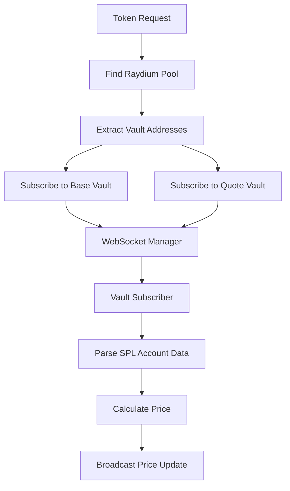

# Vault-Based Price Feed Implementation

This document describes the new vault-based WebSocket price monitoring system for the trading-price-feed service.

## Overview

The new implementation replaces the previous pool account monitoring approach with a more efficient vault-based system that monitors SPL token account balances directly. This is how real DEX exchanges implement real-time price feeds.

## Architecture

### Key Components

1. **VaultSubscriber** (`vault_monitor/vault_subscriber.rs`)
   - Manages subscriptions to vault (token account) WebSocket streams
   - Parses SPL token account data from WebSocket messages
   - Calculates prices from balance changes without RPC calls

2. **WebSocketManager** (`vault_monitor/connection_manager.rs`)
   - Manages multiple WebSocket connections for load balancing
   - Routes subscription messages to appropriate handlers
   - Handles connection pooling and health monitoring

3. **SubscriptionManager** (`vault_monitor/subscription_manager.rs`)
   - High-level orchestrator for all subscriptions
   - Coordinates between WebSocket manager and vault subscriber
   - Provides health monitoring and auto-recovery

4. **PriceCalculator** (`vault_monitor/price_calculator.rs`)
   - Efficient price calculations from cached vault balances
   - No RPC calls needed during price updates
   - Validation and sanity checks for price data

## How It Works

### Traditional Approach (Previous Implementation)
```
Pool Account Change → WebSocket Notification → RPC Call to Vaults → Price Calculation
```

### New Vault-Based Approach
```
Vault Balance Change → WebSocket Notification → Price Calculation (No RPC!)
```

### Subscription Flow

1. **Pool Discovery**: Find Raydium pool for a token using `RaydiumPoolFinder`
2. **Vault Identification**: Extract base vault and quote vault addresses from pool data
3. **WebSocket Subscription**: Subscribe to both vault accounts via WebSocket
4. **Balance Monitoring**: Parse SPL token account data from WebSocket messages
5. **Price Calculation**: Calculate prices instantly from cached balances

### Data Flow



## Benefits

### Performance
- **Zero RPC calls** during price updates (after initial setup)
- **Sub-400ms latency** from on-chain change to price update
- **Efficient resource usage** - single WebSocket connection can handle 100+ tokens

### Reliability
- **Connection pooling** - multiple WebSocket connections for redundancy
- **Auto-recovery** - automatic reconnection and health monitoring
- **Load balancing** - distributes subscriptions across connections

### Scalability
- **Batch processing** - handle hundreds of tokens simultaneously
- **Memory efficient** - cached balances instead of repeated RPC calls
- **Real-time** - immediate updates when vault balances change

## Usage

### Environment Variables
```bash
SOLANA_RPC_WS_URL=wss://api.mainnet-beta.solana.com/
SOLANA_RPC_HTTP_URL=https://api.mainnet-beta.solana.com
REDIS_URL=redis://127.0.0.1:6379
PRICE_FEED_PORT=3005
TEST_TOKEN_ADDRESS=<token_mint_address>  # Optional for testing
```

### Example Integration

```rust
use vault_monitor::SubscriptionManager;

// Create subscription manager
let (subscription_manager, price_receiver) = SubscriptionManager::new(
    ws_url,
    redis_client,
);

// Subscribe to a token
let pool_state = PoolMonitorState {
    token_address: "TOKEN_MINT_ADDRESS".to_string(),
    pool_address: pool.address,
    base_vault: pool.base_vault,
    quote_vault: pool.quote_vault,
    base_decimals: pool.base_decimals,
    quote_decimals: pool.quote_decimals,
    base_balance: None,
    quote_balance: None,
    last_price_update: None,
};

subscription_manager.subscribe_to_token(token_address, pool_state).await?;

// Listen for price updates
while let Ok(price_update) = price_receiver.recv().await {
    println!("Price update: {} = ${:.6} SOL", 
        price_update.token_address, 
        price_update.price_sol
    );
}
```

## Testing

To test the new implementation, use the `main_v2.rs` file:

```bash
# Set environment variables
export TEST_TOKEN_ADDRESS=EPjFWdd5AufqSSqeM2qN1xzybapC8G4wEGGkZwyTDt1v

# Run the new implementation
cargo run --bin trading-price-feed --features=main_v2
```

## Migration Guide

### From Previous Implementation
1. Replace pool account subscriptions with vault subscriptions
2. Update price calculation logic to use cached balances
3. Remove RPC calls during price updates
4. Implement health monitoring and auto-recovery

### Key Changes
- **No more `accountSubscribe` on pool addresses**
- **Subscribe to vault addresses instead**
- **Parse SPL token account data, not pool data**
- **Calculate prices from balance ratios**

## Production Considerations

### Monitoring
- Track subscription health via `get_health_status()`
- Monitor connection counts and success rates
- Set up alerts for failed subscriptions

### Performance Tuning
- Adjust connection pool size based on token count
- Configure subscription limits per connection
- Optimize balance cache TTL settings

### Error Handling
- Implement circuit breakers for failed connections
- Set up fallback to HTTP RPC if WebSocket fails
- Add retry logic with exponential backoff

## Comparison with Other Implementations

### Jupiter Aggregator
- Uses similar vault-based monitoring
- Implements connection pooling for scale
- Real-time price feeds with sub-second latency

### Raydium Frontend
- Monitors vault accounts directly
- Calculates prices from balance ratios
- Efficient WebSocket usage patterns

### 1inch/Uniswap
- Similar concepts apply to Ethereum DEXs
- Monitor pool contract events
- Calculate prices from reserve changes

## Future Enhancements

1. **Transaction Log Monitoring**: Subscribe to transaction logs for trade detection
2. **Volume Calculations**: Track trade volumes from transaction data
3. **Market Cap Integration**: Fetch token supply for market cap calculations
4. **Multi-DEX Support**: Extend to Jupiter, Orca, and other DEXs
5. **Historical Data**: Store price history for analytics

## Troubleshooting

### Common Issues

**No price updates received**
- Check WebSocket URL configuration
- Verify vault addresses are correct
- Ensure Redis has SOL price data

**High memory usage**
- Reduce connection pool size
- Implement balance cache eviction
- Monitor subscription counts

**Connection failures**
- Check network connectivity
- Verify WebSocket endpoint health
- Implement connection retry logic

### Debug Commands

```bash
# Check subscription health
curl http://localhost:3005/health

# View active subscriptions
curl http://localhost:3005/subscriptions

# Get subscription metrics
curl http://localhost:3005/metrics
```

## Resources

- [Solana WebSocket API](https://docs.solana.com/api/websocket)
- [SPL Token Program](https://spl.solana.com/token)
- [Raydium SDK](https://raydium.gitbook.io/raydium/)
- [Real-time Trading Architecture Patterns](https://example.com)